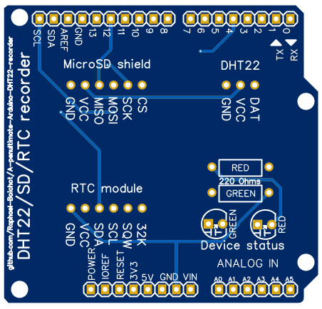

## Yet another Arduino DHT22 automatic recorder on SD card

## Why ?
Because I was not satisfied by other similar projects for my particular need: recording temperature and humidity every minute for very long periods of time (typically weeks) in remote parts of buildings. This device is so intended to be lost somewhere and survive power failures without much consequences on data stored. I've used it for recording two consecutive weeks of temperature and humidity without touching it, it worked. Current draw is very minimal and it can run for days/weeks on a powerbank.

## How to use it ?
- Install the [Arduino IDE](https://www.arduino.cc/en/software), the [Adafruit DHT library](https://github.com/adafruit/DHT-sensor-library) and the [Adafruit RTClib library](https://github.com/adafruit/RTClib) from the library manager;
- Flash the DHT22_SD_Set_RTC.ino code to the device, it will set the date/time of the RTC module from the computer. The green LED stays ON if everything is OK;
- Then flash the DHT22_SD_Recorder.ino code. It immediately starts recording. You can follow what happens on the Arduino IDE serial or use Read_from_Serial.m to plot temperature and humidity in live from Matlab;
- As long as green LED flashes, everything is OK with the 3 modules;
- SD card can be removed at any time to plot data, the device does not care, no need to power cycle it to plus the SD card back;
- When finished, data can be plotted from the SD card with Read_from_txt_file.m, the Matlab code provided, but any other code would work as the data format is very simple;
 
## Parts needed
- An [Arduino Uno](https://fr.aliexpress.com/item/1005006088733150.html), the cheaper the better;
- A [generic microSD shield](https://fr.aliexpress.com/item/1005006059963950.html) or any other size if you do not use the custom PCB;
- A [DHT22 module with everything integrated](https://fr.aliexpress.com/item/1005005996195284.html). The red AM2302 stuff is the one I used;
- A [DS3231 RTC module](https://fr.aliexpress.com/item/1005005973972157.html).
- A [Custom PCB](https://github.com/Raphael-Boichot/A-penultimate-Arduino-DHT22-recorder/tree/main/PCB) if you want to stay on the neat side. Order at [JLCPCB](https://jlcpcb.com/), it's cheap and custom clean for Eu citizens;
- 2 [regular 5 mm LEDs](https://fr.aliexpress.com/item/32848810276.html) (red and green) and two [through hole resistors](https://fr.aliexpress.com/item/32866216363.html) of about 220 Ohms (low value = high brighness).

To what I understand, pinout for SD card must be strict on Arduino and only Chip Select pin can be changed, so refer to the pinout given in the project. If you use an SD shield with prototyping board, CS may differ (it's generally 4, 6 or 10 by default).
  
## The pinout

## The PCB that comes with the project (for Arduino Uno)

The PCB comes with its json sources that can be edited with [EasyEDA std Edition](https://easyeda.com/page/download) if you want to customize it.

## Funfact
If this device did not generate energy savings for the moment, it at least proved that the energy saving closure of a certain French university during two consecutive winters was only a political display since the heating remained on full blast during the entire closure.
