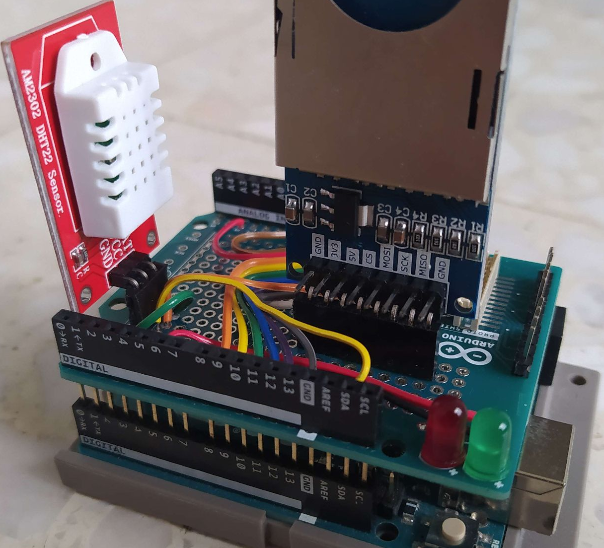

## Yet another Arduino DHT22 automatic recorder on SD card

## Why ?
Because I was not satisfied by other similar projects for my particular need: recording temperature and humidity every minute for very long periods of time (typically weeks) in remote parts of buildings. This device is so intended to be lost somewhere and survive power failures without much consequences on data stored. I've used it for recording two consecutive weeks of temperature and humidity without touching it, it worked. Current draw is very minimal and it can run for days/weeks on a powerbank.

## How to use it ?
- Install the [Arduino IDE](https://www.arduino.cc/en/software) and the [Adafruit DHT library](https://github.com/adafruit/DHT-sensor-library) library from the library manager;
- Flash the .ino code to the device, it will start immediately; 
- Boot with SD card inserted. Green LED flashing, SD card ready, red LED flashing, SD card not ready. If "data.txt" does not exist on SD card, it creates it automatically. If SD card is not inserted, it continues anyway. the text "00.00 00.00" is written one time at every boot to mark the event (this signifies that you can reboot voluntarily to mark certain events);
- One of the two color LED flashes every second very briefly to indicate the status of SD card. Status is updated at every attempt to write on SD card;
- After one minute, it writes temperature and humidity on the SD card by appending on "data.txt", green LED flashing, SD card ready, red LED, SD card not ready. Data also sent to the serial in any case;
- The cycle goes on as long as the SD card is not full, which may never happen in real life. The SD card can be removed and hot plugged again to check data during acquisition without rebooting the device. Other said, it can work with or without SD card inserted;
- When finished, data can be plotted with the Matlab code provided but any other code would work as the data format is very simple;
- Additionnaly another Matlab code provided allows data recording live from the serial port (it writes data to SD card anyway).
 
## Parts needed
- An [Arduino Uno](https://fr.aliexpress.com/item/1005006088733150.html), the cheaper the better;
- A [generic SD shield](https://fr.aliexpress.com/item/1005006005013220.html) (regular or micro, just check for the presence of a 3.3 volts regulator on board);
- A [DHT22 module with everything integrated](https://fr.aliexpress.com/item/1005005996195284.html). The red AM2302 stuff is the one I used;
- A [prototyping board](https://fr.aliexpress.com/item/1005005992632489.html) if you want to stay on the neat side;
- Two leds and two 220 Ohms resistors. In fact the Arduino D pins are current limited to 20 mA so no resistor is probably OK too (I used none because I don't care and my LEDs are still alive after months of use);

To what I understand, pinout for SD card must be strict on Arduino and only Chip Select pin can be changed, so refer to the pinout given in the project. If you use an SD shield, CS may differ (it's generally 4, 6 or 10 by default).
  
## The pinout

## The thing as I made it on the official Arduino prototyping board because my lab is rich

## To do (in progress)
- Add a [real time clock (RTC) module](https://fr.aliexpress.com/item/1005005973972157.html) support to the device.

## Funfact
If this device did not generate energy savings for the moment, it at least proved that the energy saving closure of a certain French university during two consecutive winters was only a political display since the heating remained on full blast during the entire closure.
