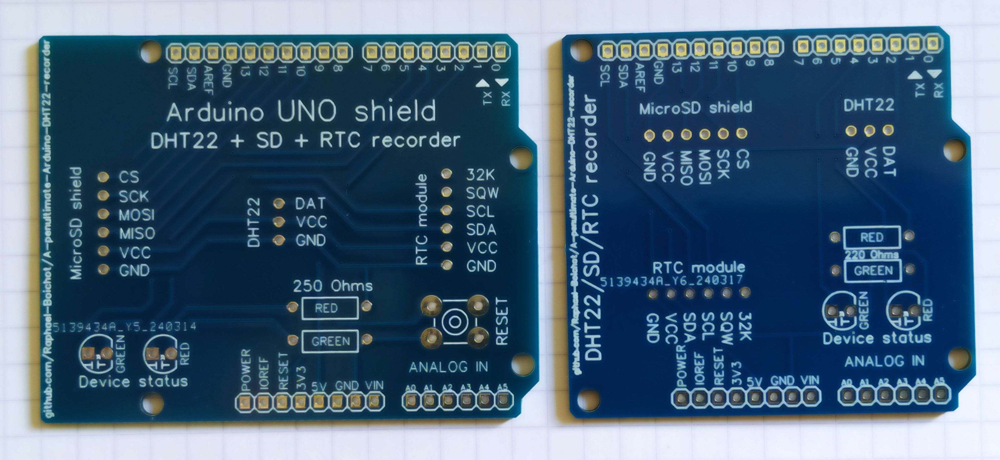
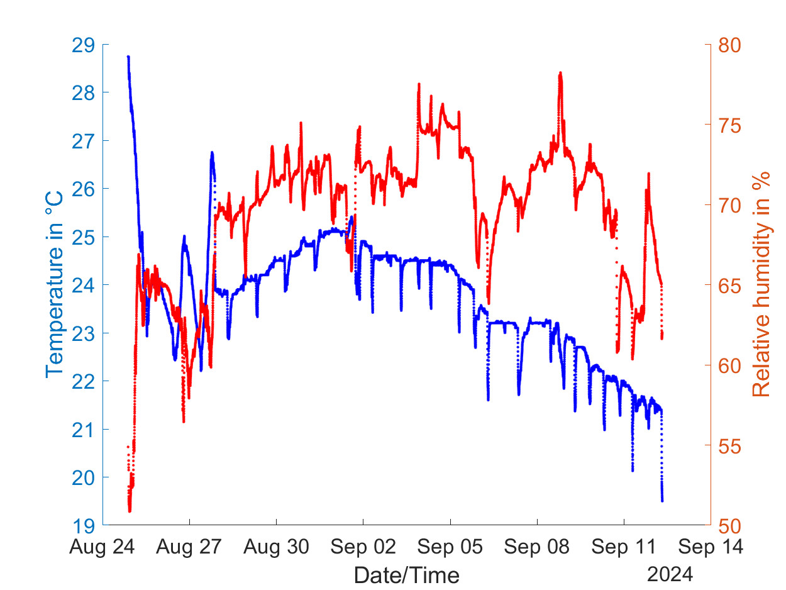

# Yet another Arduino DHT22 recorder on SD card (but with RTC)

## Why ?
Because I was not satisfied by other similar projects for my particular need: recording temperature and humidity every minute for very long periods of time (typically weeks) in remote parts of buildings. This device is so intended to be lost somewhere and survive power failures without much consequences on data stored. I've used it for recording two consecutive weeks of temperature and humidity without touching it, it worked. Current draw is very minimal and it can run for days on a powerbank. The whole price with 5 custom PCBs included should stay below 20€ shipped to your door direct through the silky road.

## How to use it ?
- Install the [Arduino IDE](https://www.arduino.cc/en/software), the [Adafruit sensor library](https://github.com/adafruit/Adafruit_Sensor), the [Adafruit DHT library](https://github.com/adafruit/DHT-sensor-library) and the [Adafruit RTClib library](https://github.com/adafruit/RTClib) from the IDE library manager;
- Flash the [DHT22_SD_Set_RTC.ino](Codes/DHT22_SD_Set_RTC/DHT22_SD_Set_RTC.ino) code to the device, it will set the date/time of the RTC module from the computer. The green LED stays ON if everything is OK. The serial must be set at 115200 bauds to check the output from Arduino IDE;
- Then flash the [DHT22_SD_Recorder.ino](Codes/DHT22_SD_Recorder/DHT22_SD_Recorder.ino) code. It immediately starts recording. You can follow what happens on the Arduino IDE serial or use [Read_from_Serial.m](Matlab_Stuff/Read_from_Serial.m) to plot temperature and humidity in live from Matlab;
- As long as green LED flashes only, everything is OK with the 3 modules. Any failure of one of them and the red LED flashes instead;
- SD card can be removed at any time to plot data, the device does not care, no need to power cycle it to plug the SD card back;
- When finished, data can be plotted from the SD card with [Read_from_txt_file.m](Matlab_Stuff/Read_from_txt_file.m), the Matlab code provided, but any other code would work as the data format is very simple;

Codes provided to extract data may be easily adapted to GNU Octave or Scilab.
 
## Parts needed
- An [Arduino Uno](https://fr.aliexpress.com/item/1005006088733150.html), the cheaper the better;
- A [generic microSD shield](https://fr.aliexpress.com/item/1005006059963950.html) or any other size if you do not use the custom PCB provided;
- A [DHT22 module with everything integrated](https://fr.aliexpress.com/item/1005005996195284.html). The red AM2302 stuff is the one I used;
- A [DS3231 RTC module](https://fr.aliexpress.com/item/1005005973972157.html). The extra chip on this board is just an independant 4kB flash chip that is not in use in this application (no idea what's the purpose in fact). It is recommended to [remove the resistor like in this image](Pictures/Resistor_to_remove.png) used for the janky charging circuit as the backup battery is not meant to be charged in fact;
- Some [male pin headers](https://fr.aliexpress.com/item/1005006104110168.html). The clearance with the Arduino Uno shield is tight, but triming the pins below the PCB is enough to go with regular 11 mm pin headers for the short board. The long one requires 15 mm pins headers at least;
- If you want to make the board entirely dismountable, use some [female regular pin headers](https://fr.aliexpress.com/item/1005006468451122.html) to connect the SD, RTC and DHT22 modules instead of soldering them directly;
- A [Custom PCB](https://github.com/Raphael-Boichot/A-penultimate-Arduino-DHT22-recorder/tree/main/PCB) if you want to stay on the neat side. Order at [JLCPCB](https://jlcpcb.com/), it's cheap and custom clean for Eu citizens contrary to PCBWay or OSHPark;
- 2 [regular 5 mm LEDs](https://fr.aliexpress.com/item/32848810276.html) (red and green) and two [through hole resistors](https://fr.aliexpress.com/item/32866216363.html) of about 220 Ohms (low value = high brighness).

To what I understand, pinout for SD card must be strict on Arduino and only Chip Select pin (CS) can be moved, so refer to the pinout given in the project. If you use an SD shield with included prototyping board, CS may differ (it's generally 4, 6 or 10 by default and sometimes even not indicated on the board...).

My own experience is that the backup battery has to be considered relevant for short accidental power loss only. The DS3231 RTC module is very seriously drifting if powered by its battery only (something like **90 minutes per day** with a fresh battery !). **It is meant to be continuously powered by VCC pin to keep on time**, which is written nowhere...
  
## The pinout (yes I like Powerpoint)

## The PCBs that come with the project (Two flavors, long and short)

## The device as you will get it (short PCB)

## Protective shell to be used with the long PCB

The PCB comes with its json sources that can be edited with [EasyEDA std Edition](https://easyeda.com/page/download) if you want to customize it. It comes very pretty in blue I think. Two models of PCB are proposed: a short that do not hide the RESET button and a long with a deported RESET button. They both work the same. **The 3D shell is designed for the long version only.**

## Example of plot output vs time

This series of data has been recorded in an attic during 2 months. Data are treated with a 10 minutes moving average.

## Example of plot output in a psychrometric chart

Same data than the preceding plot but presented differently. Data are treated with a 10 minutes moving average.

## Funfact
This device proved that the energy saving closure of a certain French university during two consecutive winters was only a political display since the heating remained on full blast during the entire closure. Thanks to this crap device I made new friends !

## Aknowledgements
The author wants to thank Pierre Chautard, Eva Azogui, Jingxiang Cao and Daniele Palladino from Phelma School of Engineering, Grenoble INP, France, for the psychrometric chart module.
